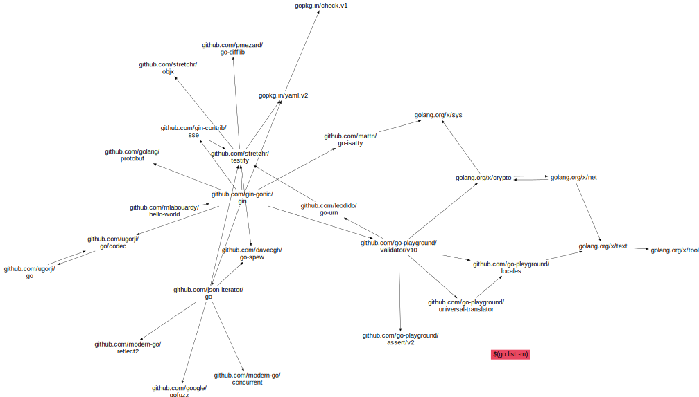

# go-dependency-managment-example

Steps for creating visual graph:

1. Install Graphviz
```
$ brew install graphviz
```
2. Run this command 
```
$ rm graph.svg && \
  cat graph_base.dot >> graph.dot && \
  go mod graph | sed -Ee 's/@[^[:blank:]]+//g' | sort | uniq | awk '{print "\""$1"\" -> \""$2"\""};' >> graph.dot && echo "}" >> graph.dot && \
  sed -i '' 's+\("github.com/[^/]*/\)\([^"]*"\)+\1\\n\2+g' graph.dot && \
  sfdp -Tsvg -o graph.svg graph.dot && \
  rm graph.dot
```
3. Ta Da!



Work Cited:
Labouardy, Mohamed. Building Distributed Applications in Gin: A hands-on guide for Go developers to build and deploy distributed web apps with the Gin framework. Packt Publishing.
